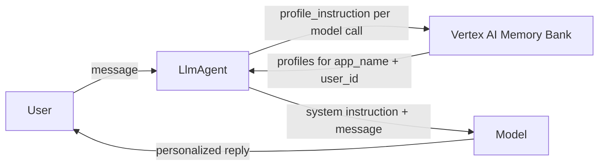

# Memory Profiles — Ambient Personalization

## Overview

Vertex AI Memory Bank stores two different things. Free-text memories are
searched semantically, which is what `BaseMemoryService.search_memory` is for.
Structured **profiles** are typed dicts tied to a schema you register on the
Agent Engine resource, and they are retrieved by scope — app name plus user id —
with no query and no ranking. `VertexAiMemoryBankService.retrieve_profiles` is
the call for those.

This sample feeds the profiles into the system instruction, so the model starts
every turn already knowing them. `LlmAgent.instruction` accepts an
`InstructionProvider` — a callable that takes a `ReadonlyContext` and returns
the instruction string, or an awaitable of it — so `profile_instruction` can be
`async` and do the lookup itself, before each model call. This needs no
framework support beyond the two pieces it already uses.

A provider runs before every model call, not once per turn. This agent has no
tools, so the two coincide. An agent that calls tools makes a model call per
tool step, and each one would re-run `retrieve_profiles`; cache on
`readonly_context.invocation_id` if one lookup per turn is what you want.

The alternative is `VertexAiLoadProfilesTool`, which exposes the same lookup as
a tool the model calls when it decides the profiles are worth having. Pick the
instruction provider when personalization should be unconditional, and the tool
when it should be the model's call.

## Setup

- `GOOGLE_CLOUD_AGENT_ENGINE_ID` — the Agent Engine whose Memory Bank holds
  your schemas (just the id, e.g. `456`, not the full resource name). The sample
  refuses to load without it.
- `GOOGLE_CLOUD_PROJECT` and `GOOGLE_CLOUD_LOCATION` — the project and location
  of that Memory Bank.
- Application Default Credentials with access to the Agent Engine.
- At least one schema registered under `structured_memory_configs` on the Agent
  Engine resource, with `scope_keys` covering `app_name` and `user_id`. Schemas
  live on the resource, not in agent code and not per request; an unregistered
  schema returns nothing here.

## Sample Inputs

- `What should I order?`

  With a profile registered and populated, the reply uses it directly instead of
  asking — the profile is already in the system instruction before the first
  token.

- `Something else, then.`

  The provider runs again on this turn, so a profile the backend has updated
  since the previous turn is picked up without restarting the session.

With no profiles under the scope, the agent falls back to the base instruction
and asks for the preferences it needs.

## Graph

## How To

- **Retrieve the profiles**: call
  `VertexAiMemoryBankService.retrieve_profiles(app_name=..., user_id=...)`. It
  returns one `MemoryProfile` per registered schema under that scope, each
  carrying the `schema_id` it came from and the `profile` dict itself. It is a
  Pydantic model, so `model_dump_json` is enough to put it in a prompt.
- **Scope it**: a `ReadonlyContext` gives you both keys —
  `readonly_context.session.app_name` and `readonly_context.user_id`. Retrieval
  only ever returns profiles under the scope you ask for.
- **Wire it as an instruction**: pass the callable as
  `LlmAgent(instruction=profile_instruction)`. A provider bypasses
  `{placeholder}` injection, so build the final string yourself.
- **Switch to the tool**: construct
  `VertexAiLoadProfilesTool(memory_service)` with the same service and pass it
  in `tools=[...]` instead.
