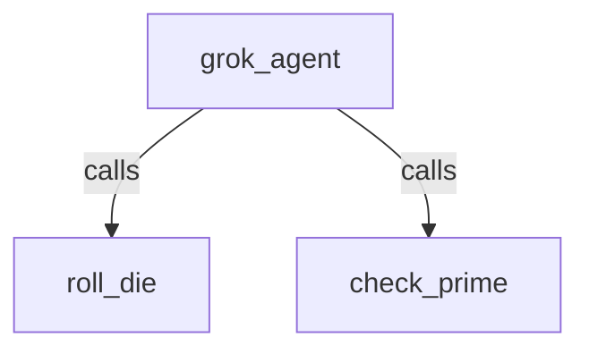

# Grok 4.6 on Vertex AI

## Overview

A hello-world agent powered by **xAI Grok 4.6**, served as a partner model on
**Vertex AI Model Garden**. Grok is reached through the OpenAI-compatible Chat
Completions surface (`endpoints/openapi`), so the
[`OpenAILlm`](../../../../src/google/adk/integrations/openai/README.md) model talks to it directly --
no LiteLLM, and no xAI API key.

The agent has two tools, `roll_die` and `check_prime`, so the sample exercises
text generation, tool calling, and multi-turn memory.

`agent.py` configures `OpenAILlm` with:

- `base_url` = the project's `.../locations/global/endpoints/openapi` surface, and
- `api_key` = a **callable** returning a fresh Application Default Credentials
  access token, re-invoked on every request so the short-lived Google Cloud
  token stays fresh instead of being hard-coded.

## Setup

1. Install the OpenAI extra from the repository root:

   ```bash
   uv sync --extra extensions
   ```

1. Enable Grok 4.6 on its
   [Model Garden card](https://console.cloud.google.com/vertex-ai/publishers/xai/model-garden/grok-4.6)
   in your GCP project.

1. Authenticate with Application Default Credentials and select your project:

   ```bash
   gcloud auth application-default login
   export GOOGLE_CLOUD_PROJECT="your-project-id"
   ```

   Optionally, set `GROK_MODEL` to target a different Grok model id (defaults
   to `xai/grok-4.6`):

   ```bash
   export GROK_MODEL="xai/grok-4.6"
   ```

   Exporting `GOOGLE_CLOUD_PROJECT` (and `GROK_MODEL`) makes them available to
   both `run.py` and the Dev UI. The Dev UI (`adk web`) additionally auto-loads
   a `.env` file in this directory, so you can put the variables there instead
   when using it; `run.py` only reads the exported shell variables. Do not
   commit `.env`. The sample always targets the `global` endpoint (the only one
   that serves Grok 4.6), so no location variable is needed.

## Run the live test

`run.py` runs the agent against the real endpoint and checks text generation,
tool calling, and multi-turn memory, printing a `PASS`/`FAIL` summary and
exiting non-zero on failure.

```bash
# Non-streaming
uv run --extra extensions python contributing/samples/models/grok/run.py

# Streaming (StreamingMode.SSE)
uv run --extra extensions python contributing/samples/models/grok/run.py --stream
```

Expected output ends with:

```text
=== RESULTS ===
  text_generation: PASS
  tool_call: PASS
  tool_response: PASS
  tool_final_text: PASS
  multi_turn: PASS

OVERALL: PASS
```

## Run With Dev UI

The Dev UI discovers `agent.py` from the sample directory:

```bash
uv run --extra extensions adk web contributing/samples/models/grok
```

Open the printed URL, select `grok`, and try
`Roll a die with 20 sides and tell me whether it is prime.`

## Notes

- Grok 4.6 reasons by default; `reasoning_effort` is not configurable on the
  Vertex preview, so `ThinkingConfig` is not used here.
- Only the **global** endpoint serves Grok 4.6, so `agent.py` always builds a
  `.../locations/global/...` `base_url`; there is no location to configure.
- The Vertex OpenAI-compatible endpoint accepts a Google Cloud access token, not
  an API key. User OAuth tokens may be rejected by org policy; ADC (user or
  service account) works.

## Graph


