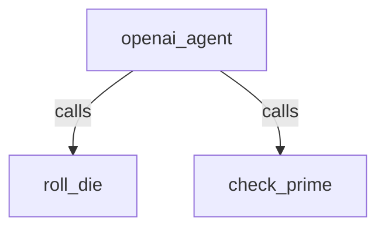

# OpenAI

## Overview

A hello-world agent powered by an **OpenAI** model through the
[`OpenAILlm`](../../../../src/google/adk/integrations/openai/README.md) model -- no LiteLLM in between.
This is the canonical case: talk to the default OpenAI host with an
`OPENAI_API_KEY`.

The agent has two tools, `roll_die` and `check_prime`, so the sample exercises
text generation, tool calling, and multi-turn memory.

`agent.py` builds `OpenAILlm(model=...)` and lets it read `OPENAI_API_KEY` from
the environment (the openai SDK's default client). Override the model with
`OPENAI_MODEL`, or point at a compatible host with `OPENAI_BASE_URL`.

## Setup

1. Install the OpenAI extra from the repository root:

   ```bash
   uv sync --extra extensions
   ```

1. Set your OpenAI API key (and optionally a model):

   ```bash
   export OPENAI_API_KEY="sk-..."
   export OPENAI_MODEL="gpt-4.1"  # optional; defaults to gpt-4.1
   ```

   Exporting the variables makes them available to both `run.py` and the Dev
   UI. The Dev UI (`adk web`) additionally auto-loads a `.env` file in this
   directory, so you can put the variables there instead when using it;
   `run.py` only reads the exported shell variables. Do not commit `.env`.

   To use an OpenAI-compatible host instead, set `OPENAI_BASE_URL`. If that host
   needs no API key, `OPENAI_API_KEY` can be left unset.

## Run the live test

`run.py` runs the agent against the real endpoint and checks text generation,
tool calling, and multi-turn memory, printing a `PASS`/`FAIL` summary and
exiting non-zero on failure.

```bash
# Non-streaming
uv run --extra extensions python contributing/samples/models/hello_world_openai/run.py

# Streaming (StreamingMode.SSE)
uv run --extra extensions python contributing/samples/models/hello_world_openai/run.py --stream
```

Expected output ends with:

```text
=== RESULTS ===
  text_generation: PASS
  tool_call: PASS
  tool_response: PASS
  tool_final_text: PASS
  multi_turn: PASS

OVERALL: PASS
```

## Run With Dev UI

The Dev UI discovers `agent.py` from the sample directory:

```bash
uv run --extra extensions adk web contributing/samples/models/hello_world_openai
```

Open the printed URL, select `hello_world_openai`, and try
`Roll a die with 20 sides and tell me whether it is prime.`

## Notes

- The model must support tool calling on Chat Completions for the `roll_die` /
  `check_prime` tools to work. Some reasoning models (for example the gpt-5.6
  family) reject function tools on Chat Completions at their default reasoning
  effort; use a model such as `gpt-4.1` here, or `OpenAIResponsesLlm` for those
  models.
- `OPENAI_BASE_URL` lets the same sample reach any OpenAI-compatible host; the
  default client reads it.

## Graph


